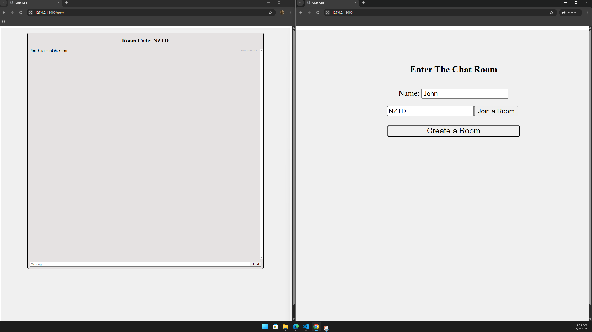
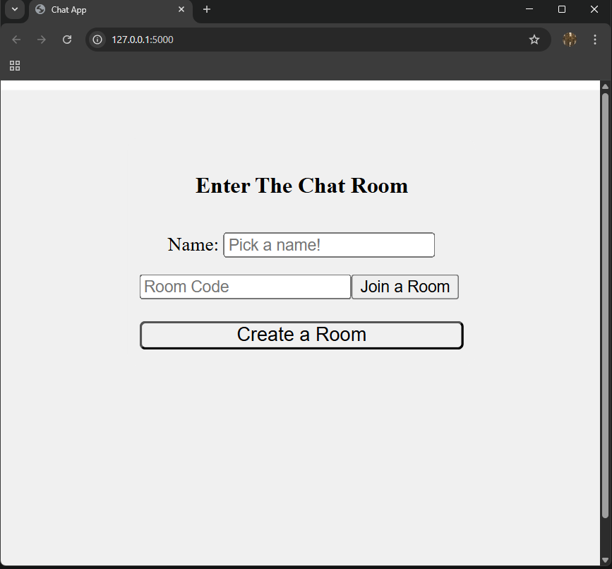
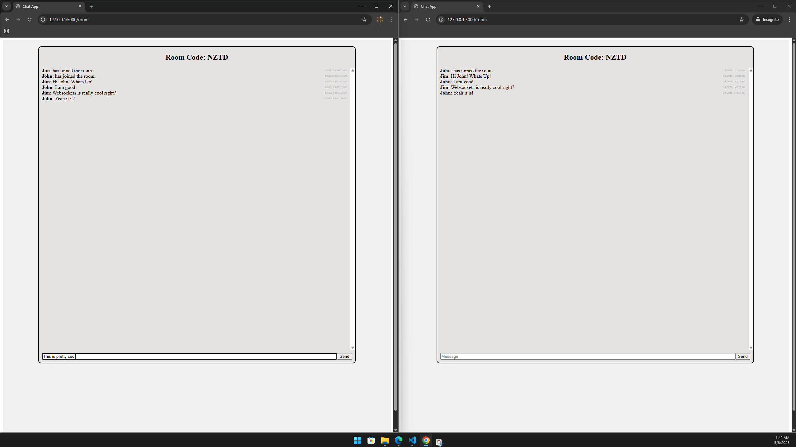

# 💬 Live Chat Room

A real-time chat application enabling users to communicate instantly in a shared environment. Designed for simplicity, responsiveness, and scalability.

---

## 🚀 Features

- **Real-Time Messaging**: Seamless communication using WebSockets.
- **Multi-User Support**: Multiple participants can join and interact simultaneously.
- **Responsive Design**: Optimized for desktops, tablets, and mobile devices.
- **User-Friendly Interface**: Clean and intuitive UI for enhanced user experience.

---

## 🛠️ Technologies Used

- **Frontend**: HTML, CSS, JavaScript
- **Backend**: Python
- **Real-Time Communication**: WebSockets
- **Styling**: Custom CSS

---

## 📸 Screenshots


| Chat Interface | Home Page | Live In Action |
|----------------|-----------|----------------|
|  |  |  |

---

## ⚙️ Installation & Setup

1. **Clone the Repository**:

   ```bash
   git clone https://github.com/Pineapsle/Live-Chat-Room.git
   cd Live-Chat-Room
